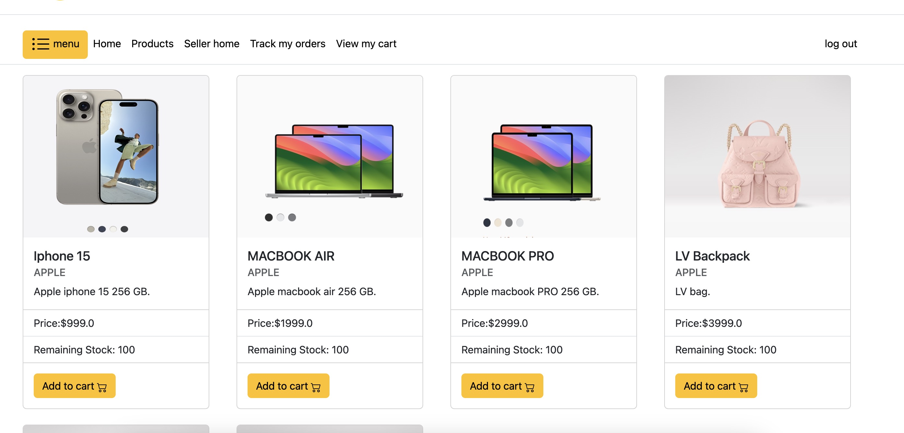
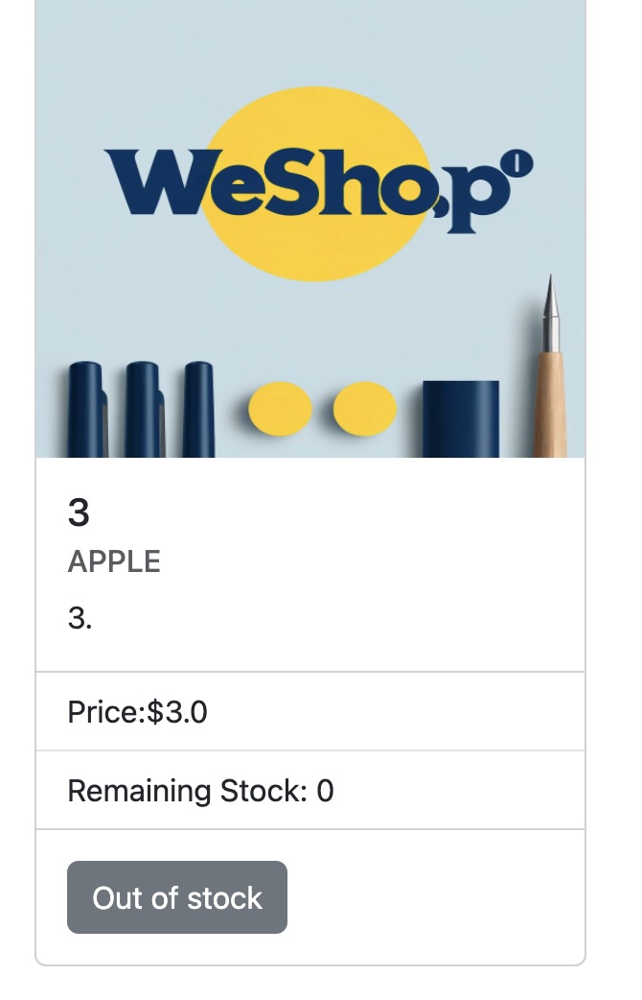
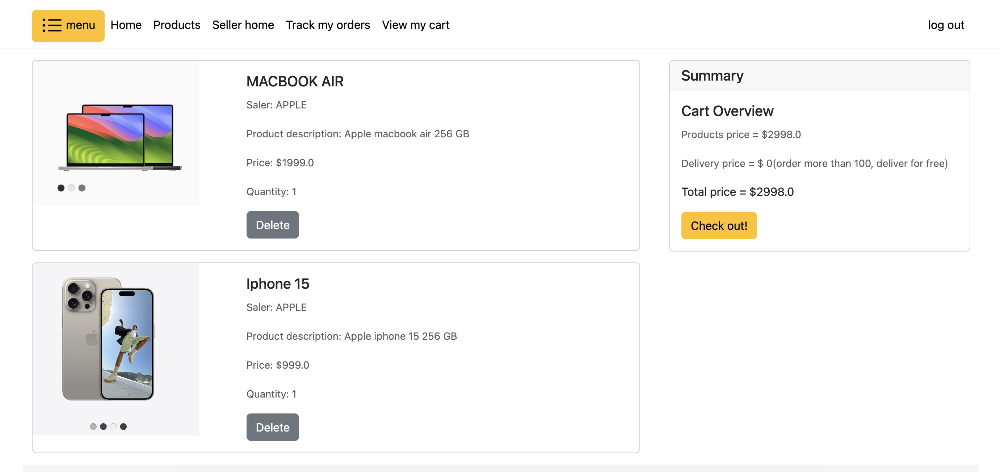
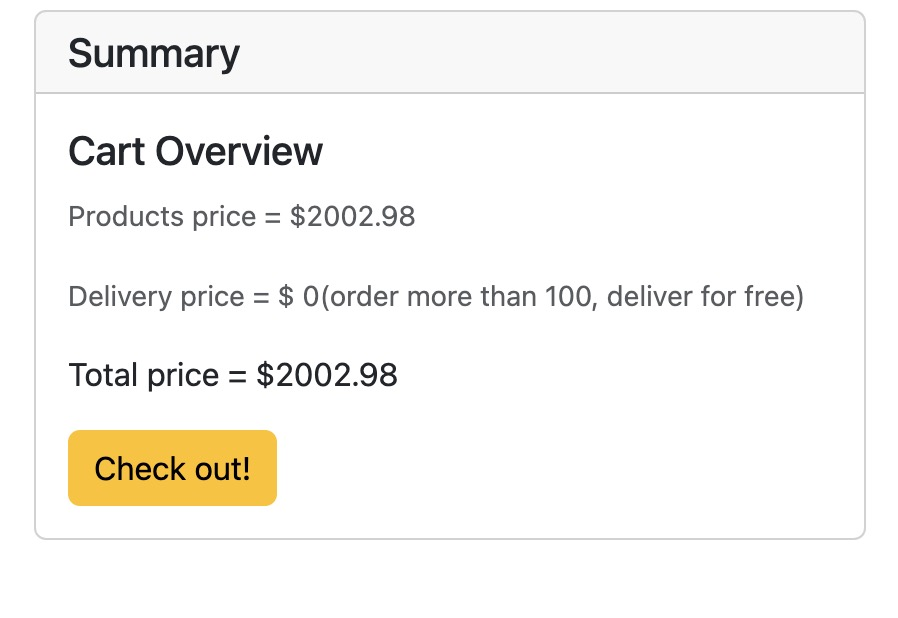

# WeShop - Mini Amazon
Welcome to our e-commerce platform, a dynamic web-based solution designed to provide a seamless shopping and selling experience for users and merchants alike. Our system incorporates a range of functionalities to manage product listings, handle transactions, and track orders efficiently.

## Shopping Cart
On our product page, we offer a seamless shopping experience that allows users to effortlessly add products to their cart. Once an item is added, users will be automatically redirected to the cart page where all the product details are displayed. Additionally, a concise summary of your selections is conveniently provided on the right side of the page for easy review.




### Out of Stock Products
If a product is out of stock (stock count is 0), the option to add it to your cart will be disabled.



### Product Uploading
If a product is still uploading (we still wait for the "purchasemore" response from the world), the option to add it to your cart will be disabled and shown as "product uploading".




We also support adding multiple products and increasing the quantity of each item in the cart. Additionally, users have the option to remove products from the cart whenever necessary.



The summary card displays the total price of your cart, including the delivery fee. For orders over $100, the delivery fee is waived. For all other orders, a delivery fee of $3.99 applies.


Clicking the "Check Out" button will take users to the checkout page. If the cart is empty, a message stating "Nothing in cart, add now" will appear, and users will be redirected to the products page to browse and add items.

## Check Out Page


On the checkout page, users can conveniently input their delivery and payment information. On the right side of the page, they'll find a summary displaying the products in the cart along with the total price.

## Track Order

We offer an order detail page where users can view their order specifics and track the status of their order in real time.


## Recommend Products Related to Order

At the bottom of the order detail page, users will find our "Recommend for You" section. This feature suggests similar products related to the items in their order, offering users the convenience of adding these recommended products directly to their cart.


## Seller Home Section

In our website, we allow users to register as sellers and upload their own products. Users can enter their seller name to register as a seller and start sharing their products with the world.


After registration, they will be redirected to the seller's homepage where users can access two key features: manage products and upload new products.

### Upload Products and Product Pictures

On the 'Upload Products' page, sellers can list their items by entering product details such as type, name, stock levels, price, warehouse ID, and a description. **Sellers can upload their product pictures.** Once submitted, these products will appear on the main products page, ready for customers to purchase.


### Manage Products

After upload, sellers can see their products on the manage products page.


## Search Function

Each page features a navbar with a search function, allowing users to easily find products by keyword. Upon clicking the search button, they will be directed to the products page, which displays all relevant search results.


## Menu Sidebar

Each page includes a sidebar that enables users to quickly navigate to specific product categories. After selecting a category and pressing the search button, users will be redirected to a products page that displays items exclusively from the chosen category.


## Homepage

Our website homepage uses a sliding window design and provides multiple entry points for users to quickly access the pages they want to visit.


## Login and Sign Up Page

We also feature functions for logging in, logging out, and signing up. If a user is not logged in, the homepage will display as described below, with a link that directs to a login page as outlined below:


If you don't have an account, simply click "Sign Up Now" to be directed to the sign-up page. There, the information you provide will be verified: the email must be in the correct format, the username must be unique, and the password must contain at least 8 characters.


If you are already logged in, the homepage will display your username, and a logout button will be available to allow you to easily log out.


## Usage Instruction

This project is implemented in Docker, so you can use it in an easy way. 

If you did not install docker before, please use 
```
sudo apt-get install docker-compose
```
to install Docker for the following usage.

Now, you can run this server by following:

```
git clone git@github.com:MorganeLu/WeShop-MiniAmazon.git
cd WeShop-MiniAmazo
sudo docker-compose up
```

Just wait for a second, you can see visit our website by localhost:8000.

## Connections and Communication

As we mentioned before, this server can be linked with other servers and the protocol we used can be found at final_proto.pdf file. The following image shows our workflow.

  
